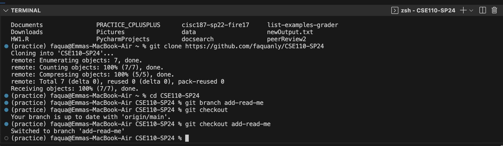

# CSE 110 - LAB1

1. **Introduction:**
   - My name is Emma Nguyen. My PID is A18021060.
   - I transfered from Miramar College and I am currently a 3th year Computer Science major. I am very excited to be in CSE 110 and learn about software engineering.
   - Programming languages: `Java`, `C++`, `Python`.
   - Relative links: [Linked](https://www.linkedin.com/in/emma-nguyen-84a226117/)

     
2. **Part 2. (Re)Familiarizing Ourselves with Git:**
   
   - 
  
   - 
     
3. **Section links:**
   [README.md](https://faquanly.github.io/CSE110-lab1/)

4. **Task lists:**

   -[x] Part 1
   
   -[ ] https://faquanly.github.io/CSE110-lab1/
